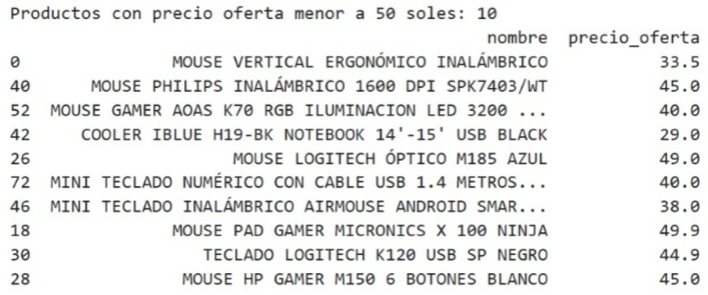
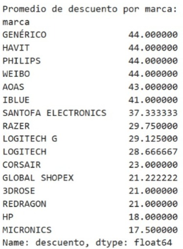
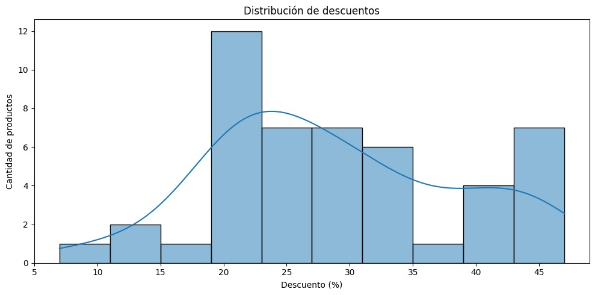

# Scraping Mouses Ripley

Este proyecto realiza un **web scraping** en el sitio web de **Ripley Perú** para extraer información sobre mouses gamer disponibles en su catálogo. Los datos extraídos incluyen el nombre, marca, precio regular, precio de oferta y descuento de cada producto. El análisis incluye visualizaciones sobre la correlación de precios, descuentos, y más.

## Tecnologías Utilizadas

- **Selenium**: Para realizar el scraping y navegar por la página.
- **Pandas**: Para procesar y analizar los datos extraídos.
- **Matplotlib** y **Seaborn**: Para la visualización de los datos y gráficos.
- **Openpyxl**: Para guardar los datos extraídos en un archivo Excel.

## Instalación

### 1. Requisitos previos

Antes de ejecutar este proyecto, necesitarás instalar las dependencias necesarias. Para hacerlo, puedes utilizar el archivo `requisitos.txt`:

1. Clona este repositorio o descarga el código.

2. Crea un entorno virtual (opcional pero recomendado):

    ```bash
    python -m venv venv
    ```

3. Activa el entorno virtual:
    - En **Windows**:
      ```bash
      venv\Scripts\activate
      ```
    - En **macOS/Linux**:
      ```bash
      source venv/bin/activate
      ```

4. Instala las dependencias desde el archivo `requisitos.txt`:

    ```bash
    pip install -r requisitos.txt
    ```

### 2. Instalación de `chromedriver`

Este proyecto utiliza **Selenium** y necesita **`chromedriver`** para funcionar. El archivo `chromedriver` debe estar instalado y accesible en tu sistema.

#### Pasos para instalar `chromedriver`:

1. Descarga la versión compatible con tu navegador desde el siguiente enlace:
   - [Descargar `chromedriver`](https://sites.google.com/a/chromium.org/chromedriver/downloads)

2. Extrae el archivo descargado y colócalo en un directorio de tu elección, preferiblemente dentro de la carpeta de tu proyecto o en un lugar fácil de encontrar.

3. En el archivo `main.py`, asegúrate de apuntar a la ubicación correcta del `chromedriver`. Si lo colocas dentro de la carpeta del proyecto, la ruta sería algo como:

    ```python
    chromedriver_path = "C:/ruta/a/tu/chromedriver.exe"
    ```

4. ¡Listo! Ahora podrás ejecutar el proyecto sin problemas.

**Nota**: Asegúrate de tener instalada la misma versión de **Google Chrome** que la versión de **chromedriver** descargada. Si tienes dudas sobre cómo verificar la versión de Chrome, puedes hacerlo desde `chrome://settings/help`.

## Análisis y Gráficos

Este proyecto genera varios análisis y visualizaciones basados en los datos extraídos. Los siguientes gráficos están disponibles:

### 1. Correlación entre Precio Regular y Precio de Oferta


### 2. Productos con Precio Oferta Menor a 50 Soles



### 3. Promedio de Descuento por Marca



### 4. Top 5 Productos con Mayor Descuento


### 5. Distribución de Descuentos



## Ejecución

Para ejecutar el script, simplemente corre el archivo `main.py`:

```bash
python main.py
